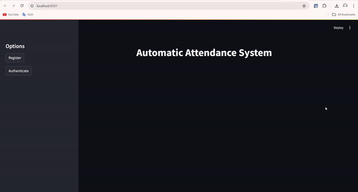
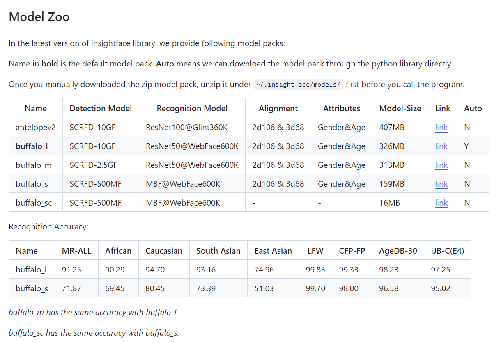

# Facial Recognition Attendance System

## Project Description
This project leverages facial recognition technology using deep learning with the InsightFace AI model to mark attendance for university students participating in classes.


## Demo



## Features
- **Attendance Tracking**: Automatically mark student attendance using facial recognition.
- **New Face Registration**: Register new student faces to the system for future recognition.

## Installation Guide
To set up the project, follow these steps:

1. Install [Anaconda](https://www.anaconda.com/).
2. Create a new conda environment named `insightFace`:
   ```bash
   conda create --name insightFace python=3.10
   ```
3. Activate the environment:
   ```bash
   conda activate insightFace
   ```
4. Install all required libraries:
   ```bash
   pip install -r requirements.txt
   ```

## Usage Guide
To run the project, follow these steps:

1. Download the pre-trained InsightFace model from [this link](https://github.com/deepinsight/insightface/tree/master/python-package).
2. Unzip the downloaded file and place the model into the `.insightface/models` directory. 
   - In this project, we are using the **buffalo_l** model with a size of 326MB.
   
   
3. Use the following command to launch the web interface:
   
   ```bash
   streamlit run web_deploy.py
   ```

## Author
Nguyen Tien Anh
